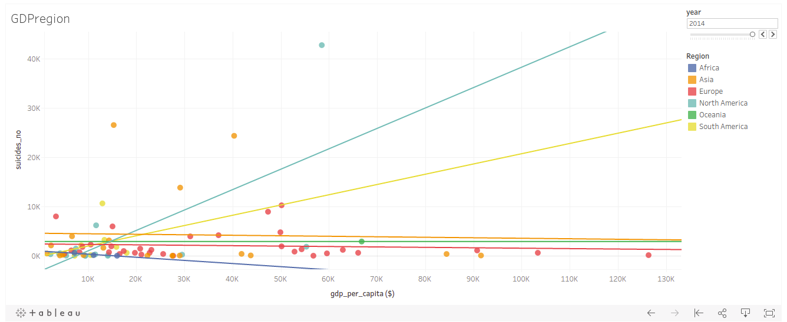

# Ironhack-Module-2-Project-MyProject
The following project attempts to identify whether exists a relationship between suicides and GDP per capita. The analysis encompasses data gathered from 1985 to 2015 coming from a broad number of countries throughout the world.

Original dataset might be found here: https://www.kaggle.com/russellyates88/suicide-rates-overview-1985-to-2016

As a conclusion, it was determined that GDP per capita does not affect the number of suicides in countries from Asia, Europe and Oceania. Countries from North and South America, however, show a different picture. We can see a direct relationship between these two variables.

Flat lines suggest that a variation in GDP per capita won't affect the number of suicides, while an upward tilted line reads into a directly proportional link.

